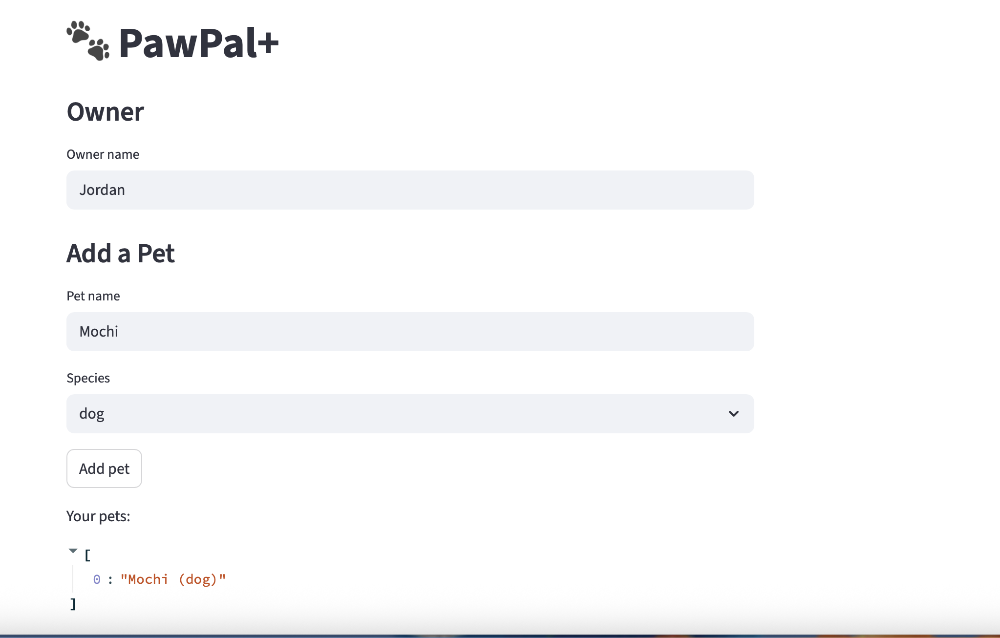

# PawPal+ (Module 2 Project)

**PawPal+** is a Streamlit app that helps a busy pet owner build a realistic daily care plan for one or more pets. You add your pets, define their tasks with priorities and durations, and the scheduler fills your day — flagging conflicts and automatically re-queuing recurring tasks so nothing falls through the cracks.

---

## Features

### Multi-pet management
Add any number of pets, each with their own task list. The owner object links everything together so the scheduler can plan across all pets at once.

### Priority-based scheduling
Tasks are ranked **High → Medium → Low** before time slots are assigned. High-priority tasks (medication, feeding) always claim the earliest slots in your day.

### Sorting by time
Once scheduled, tasks are always displayed in chronological order using `Scheduler.sort_by_time()`. Whether you add tasks out of order or reschedule one mid-day, the view stays coherent.

### Task filtering
Narrow any task list by pet name, completion status, or both — without regenerating the schedule. Useful for a quick "what's left for Buddy today?" check.

### Recurring tasks
Mark a task's frequency as **once**, **daily**, or **weekly**. When a recurring task is completed, the next occurrence is automatically created with the correct due date (`today + 1` or `today + 7` days). No manual re-entry needed.

### Conflict detection
After scheduling, `Scheduler.detect_conflicts()` scans every adjacent pair of tasks and reports any overlap as a plain-English warning — shown prominently in the UI before the schedule table so you can fix it before your day starts.

### Unscheduled task notice
Any pending tasks that don't fit within your time window are listed by name so you know they were seen but not placed, rather than silently dropped.

---

## Scenario

A busy pet owner needs help staying consistent with pet care. They want an assistant that can:

- Track pet care tasks (walks, feeding, meds, enrichment, grooming, etc.)
- Consider constraints (time available, priority, owner preferences)
- Produce a daily plan and explain why it chose that plan

## Getting started

### Setup

```bash
python -m venv .venv
source .venv/bin/activate  # Windows: .venv\Scripts\activate
pip install -r requirements.txt
```

### Run the app

```bash
streamlit run app.py
```

## Testing PawPal+

### Run the test suite

```bash
python -m pytest tests/test_pawpal.py -v
```

### What the tests cover

| Area | Tests |
|---|---|
| **Task completion** | `mark_complete()` flips `completed` to `True` |
| **Pet task list** | `add_task()` increases `pet.tasks` count |
| **Sorting** | `sort_by_time()` returns chronological order; handles empty schedule |
| **Recurrence** | Daily tasks auto-create a new task on completion with `due_date = today + 1`; weekly uses `+ 7`; one-time tasks do not recur; unlinked tasks don't crash |
| **Conflict detection** | Clean schedule has no conflicts; manually overlapping two tasks triggers a warning; single-task schedule never conflicts |
| **Filtering** | `filter_tasks(pet_name=...)` isolates one pet's tasks; `filter_tasks(completed=False)` excludes done tasks |

### Confidence level

★★★★☆ — Core scheduling paths (priority ordering, slot assignment, recurrence, conflict detection) are fully covered. The remaining gap is integration-level edge cases: tasks whose duration alone exceeds the full day window, and `filter_tasks` combining both arguments simultaneously.

### 📸 Demo


