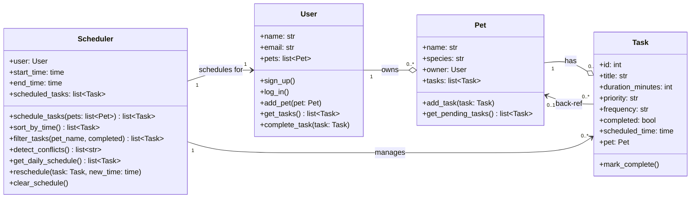

# PawPal+ Project Reflection

## 1. System Design

**a. Initial design**

- Initial Components: add a pet, schedule a walk, see today's tasks

- Briefly describe your initial UML design.

- User (Object)
    - `name: str` — the owner's display name (Attribute)
    - `email: str` — used for login/identification (Attribute)
    - `pets: list[Pet]` — all pets belonging to this user (Attribute)
    - `sign_up() / log_in()` — authenticate and create/load a user session (Method)
    - `add_pet(pet: Pet)` — append a new pet to the user's pet list (Method)
    - `get_tasks() -> list[Task]` — aggregate all tasks across all owned pets (Method)
    - `complete_task(task: Task)` — mark a task done and remove it from the active schedule (Method)

- Pet (Object)
    - `name: str` — the pet's name (Attribute)
    - `species: str` — e.g. "dog", "cat", "other"; used to apply species-specific scheduling rules (Attribute)
    - `owner: User` — back-reference to the owning User (Attribute)
    - `tasks: list[Task]` — care tasks associated with this specific pet (Attribute)
    - `add_task(task: Task)` — attach a new care task to this pet (Method)
    - `get_pending_tasks() -> list[Task]` — return only incomplete tasks, sorted by priority (Method)

- Task (Object)
    - `title: str` — short label for the task, e.g. "Morning walk" (Attribute)
    - `duration_minutes: int` — how long the task takes; used by the scheduler to fit tasks into the day (Attribute)
    - `priority: str` — "low" | "medium" | "high"; higher-priority tasks are scheduled first (Attribute)
    - `completed: bool` — tracks whether the task has been finished (Attribute)
    - `scheduled_time: str | None` — the time slot assigned by the scheduler, e.g. "8:00 AM" (Attribute)
    - `mark_complete()` — set `completed = True` (Method)

- Scheduler (Object)
    - `user: User` — the user whose pets' tasks are being scheduled (Attribute)
    - `start_time: str` — earliest time slot available for scheduling, e.g. "7:00 AM" (Attribute)
    - `end_time: str` — latest time slot available for scheduling, e.g. "9:00 PM" (Attribute)
    - `scheduled_tasks: list[Task]` — ordered list of tasks that have been assigned time slots (Attribute)
    - `schedule_tasks(tasks: list[Task]) -> list[Task]` — sort tasks by priority and assign time slots sequentially (Method)
    - `get_daily_schedule() -> list[Task]` — return all scheduled tasks for the day in chronological order (Method)
    - `reschedule(task: Task, new_time: str)` — move a task to a different time slot and update the schedule (Method)
    - `clear_schedule()` — remove all scheduled time slots and reset the schedule (Method)

---

**UML Class Diagram**

- What classes did you include, and what responsibilities did you assign to each?

I included a class for User, Pet, Task, and Scheduler. The User has the ability to add pets, and get and complete tasks. 
The Pet has associated tasks which can be added to. The scheduler has the ability to schedule/reschedule/clear tasks. Each task can only be completed, as all "active" duties are done by the other objects.

**b. Design changes**

- Did your design change during implementation?

- If yes, describe at least one change and why you made it.

Issues from Claude:

Missing Relationships

Task has no back-reference to Pet — User.complete_task(task) needs to find and remove the task from a specific pet's list, but there's no task.pet to navigate to. You'd have to loop through all pets to find it.

Scheduler can't apply species-specific rules — your design notes mention species-based scheduling, but Scheduler only sees User → flat list[Task]. It has no path to task → pet → species.

Logic Bottlenecks

Duplicate "complete" responsibility — both Task.mark_complete() and User.complete_task(task) exist. It's unclear who owns this. User.complete_task presumably calls task.mark_complete(), but then what does it do differently? If it also removes the task from Pet.tasks, you need the back-reference from point 1.

Scheduler.scheduled_tasks can drift out of sync with Pet.tasks — tasks live in two places. If a task is added to a pet after scheduling, or a pet's task is removed, the scheduler's list won't know.

start_time/end_time as str — scheduling arithmetic (e.g., assigning sequential time slots in schedule_tasks) requires parsing strings like "7:00 AM" repeatedly. This is error-prone; consider storing as datetime.time internally.

No task identity — Task has no id field. If a user has two pets each with a "Morning walk" task, reschedule(task, new_time) has no reliable way to distinguish them

Issues Fix
No task → pet link	Add pet: Pet = None attribute to Task.__init__, set it in Pet.add_task
Scheduler can't see species	Pass tasks with their pet context, or let schedule_tasks receive list[Pet] instead
Duplicate complete logic	Have User.complete_task call task.mark_complete() and then remove from the correct pet's list via task.pet
No task identity	Add id: int (e.g., using a class-level counter) to Task
The Task → Pet back-reference is the most load-bearing fix — it unblocks both the complete logic and the species-aware scheduling.

I agreed with Claude on the changes, and let it make the necessary steps. 

---

## 2. Scheduling Logic and Tradeoffs

**a. Constraints and priorities**

- What constraints does your scheduler consider (for example: time, priority, preferences)?
- How did you decide which constraints mattered most?

The scheduler considers two hard constraints: the owner's available time window (`start_time` to `end_time`) and each task's `duration_minutes`. Tasks that don't fit in the remaining window are dropped. Within those constraints, tasks are ranked by a soft constraint — `priority` ("high", "medium", "low") — using a lookup dict (`PRIORITY_ORDER`) so higher-priority tasks always claim earlier slots.

Priority was chosen as the primary ordering factor because a pet care context has genuinely urgent tasks (medication, feeding) that must happen before optional ones (playtime). Time-window enforcement is the secondary hard stop because scheduling past the owner's availability produces an unrealistic plan.

**b. Tradeoffs**

- Describe one tradeoff your scheduler makes.
- Why is that tradeoff reasonable for this scenario?

The conflict detector only compares adjacent tasks after sorting by start time, not every possible pair. This means it catches all sequential overlaps in the generated schedule but would miss a long task that spans the start time of a non-adjacent shorter task. This tradeoff is reasonable here because `schedule_tasks` assigns slots sequentially — it never intentionally places two tasks at the same time — so real conflicts only arise when a task is manually rescheduled via `reschedule()`. In that narrow case, checking neighbors is sufficient and keeps the method O(n) instead of O(n²).

---

## 3. AI Collaboration

**a. How you used AI**

- How did you use AI tools during this project (for example: design brainstorming, debugging, refactoring)?
- What kinds of prompts or questions were most helpful?

AI was used across every phase: initial UML critique (identifying missing back-references and duplicate logic), implementation of class skeletons, adding docstrings, wiring the Streamlit UI to the backend classes, and extending the scheduler with sorting, filtering, recurring tasks, and conflict detection.

The most useful prompt style was describing the *goal behavior* rather than asking for code directly — for example, "when a daily task is marked complete, a new instance should auto-create for tomorrow" produced a focused implementation in `mark_complete()`. Asking "why would there be a pet in session state if an owner has multiple pets?" also surfaced a design flaw before any code was written.

**b. Judgment and verification**

- Describe one moment where you did not accept an AI suggestion as-is.
- How did you evaluate or verify what the AI suggested?

Initially, the AI was trying to add a pet to the state, instead of the ability to add multiple pets. This didn't make sense, so I prompted and it used the add_pets logic.

---

## 4. Testing and Verification

**a. What you tested**

- What behaviors did you test?
- Why were these tests important?

Two unit tests were written in `tests/test_pawpal.py`:

1. **Task completion** — calls `mark_complete()` and asserts `task.completed` flips from `False` to `True`. This matters because the scheduler's `filter_tasks(completed=False)` and `get_pending_tasks()` both depend on this flag being set correctly; a silent failure here would cause completed tasks to keep appearing in the schedule.

2. **Task addition** — adds a task to a `Pet` and asserts `len(pet.tasks)` increases by 1. This matters because `Pet.add_task` also sets the `task.pet` back-reference; verifying the count confirms the task was actually appended and not just linked in isolation.

**b. Confidence**

- How confident are you that your scheduler works correctly?
- What edge cases would you test next if you had more time?

The core scheduling path (priority sort → sequential slot assignment → time-window cutoff) is well-covered by the `main.py` demo output. Confidence is moderate for the happy path but lower for edge cases.

Edge cases to test next:
- A task whose `duration_minutes` alone exceeds the full day window (should be skipped, not crash).
- Two pets with tasks totaling exactly the available minutes (boundary condition for the `slot_end > end` check).
- A recurring task marked complete when `task.pet` is `None` (the guard exists but is untested).
- `filter_tasks` called with both `pet_name` and `completed` simultaneously to confirm the filters compose correctly.

---

## 5. Reflection

**a. What went well**

- What part of this project are you most satisfied with?

I think the scheduler is pretty thorough.

**b. What you would improve**

- If you had another iteration, what would you improve or redesign?

The UI could be cleaner. 
 
**c. Key takeaway**

- What is one important thing you learned about designing systems or working with AI on this project?

I think having the UML diagram made code generation more clear and structured.

# ADDED Questions

Which Claude features were most effective for building your scheduler?
- Building and editing files directly off UML diagrams.

Give one example of an AI suggestion you rejected or modified to keep your system design clean.
- I mentioned the pets change above. 

How did using separate chat sessions for different phases help you stay organized?
- I didn't do this, but this might've helped.